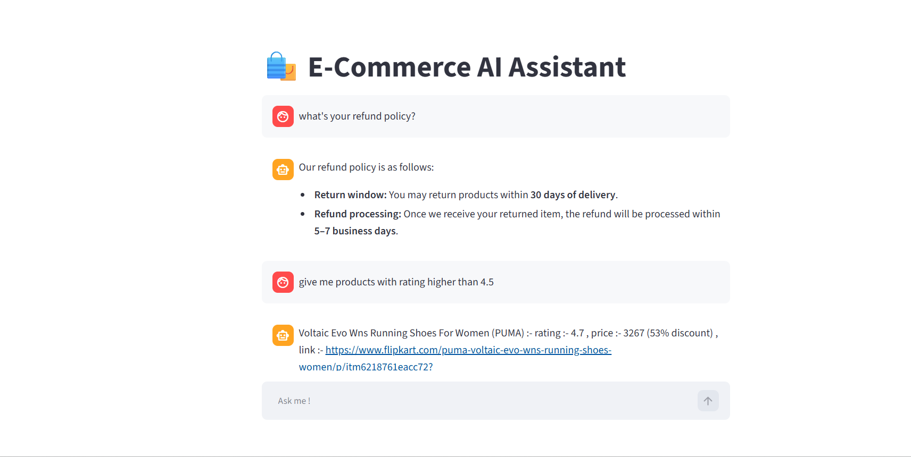

# 🛍️ E-Commerce AI Chatbot

An AI-powered e-commerce chatbot that allows users to interact with product information and frequently asked questions using natural language.

The system intelligently classifies user queries into **FAQ** or **SQL-based product queries** using a Semantic Router. Depending on the query type, relevant information is retrieved from either a **ChromaDB vector database** or a **SQLite database**, and a Groq-hosted LLM generates the final natural-language response.

---

## 📌 Project Overview

Traditional e-commerce search systems often require users to search using specific keywords or predefined filters.

This project provides a natural-language interface where users can ask questions such as:

- "What is the return policy?"
- "What should I do if I receive a defective product?"
- "Show me Nike shoes between ₹1000 and ₹3000."
- "Which products have the highest ratings?"
- "Show me products with more than 20% discount."

The chatbot automatically determines the type of query and routes it to the appropriate data source.

---

## 🏗️ System Architecture

The overall architecture of the E-Commerce AI Chatbot is shown below:


The system follows a query-routing architecture where the **Semantic Router** classifies the user's query as either an FAQ or SQL query.

- **FAQ queries** are handled using ChromaDB for retrieving relevant FAQ information.
- **SQL queries** are processed using SQLite to retrieve relevant product information.
- The retrieved context is provided to the **LLM**, which generates the final response.
- The final response is displayed to the user through the **Streamlit** interface.

---

## ✨ Features

- 🤖 Natural-language e-commerce chatbot
- 🔀 Intelligent query classification using Semantic Router
- 📚 FAQ retrieval using ChromaDB
- 🗄️ Product search using SQLite
- 🧠 LLM-powered response generation using Groq
- 🔎 Natural-language SQL query generation
- 📊 Product filtering and sorting
- 💰 Price and discount-based product search
- ⭐ Product rating-based search
- 🏷️ Brand-based product search
- 💬 Interactive Streamlit chat interface


---

## 🧠 How It Works

### 1. User Query

The user enters a natural-language question through the Streamlit chat interface.

Example:

```text
Show me Nike shoes between ₹1000 and ₹3000.
```
### 2. Semantic Router

The Semantic Router analyzes the user's query and classifies it into one of two categories:

FAQ
SQL

For example:

"What is your return policy?"
        ↓
       FAQ

and:

"Show me Nike shoes under ₹3000."
        ↓
       SQL

This allows the system to select the appropriate data source for each query.
### 3. FAQ Route

FAQ-related questions are handled using ChromaDB, a vector database.

The process is:

The user's query is converted into an embedding.
ChromaDB searches for semantically similar FAQ information.
Relevant FAQ context is retrieved.
The retrieved context is provided to the LLM.
The LLM generates the final response.
### 4. SQL Route

Product-related questions are handled using SQLite.

The user's natural-language query is converted into an SQL query using the LLM.
### 🤖 LLM Pipeline

The SQL-based route uses an LLM-driven query generation process.

Natural Language → SQL

The first LLM converts the user's natural-language query into an SQL query.

The extracted SQL query is executed using SQLite

The retrieved product data is then passed to the LLM to generate a natural-language response:
### Install Dependencies
```text
pip install -r requirements.txt

```


